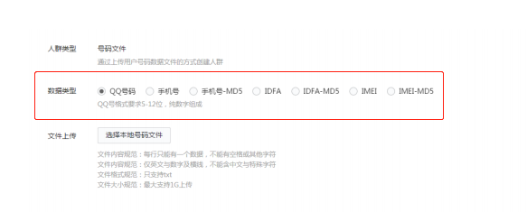

# txt2Htxt

 [](https://travis-ci.org/wwek/txt2Htxt)

txt2Htxt把文本内容进行哈希加密,用于在朋友圈、今日头条等的广告投放中加密电话号等铭感信息🔐㊙

## 遇到和解决的问题
在朋友圈、今日头条等广告投放平台推广的时候
可以通过上传"人群数据",例如QQ号码，手机号码、IDFA、IMEI等进行用户人群识别从而实现精准投放
为了数据安全（不想让推广人员拿到原始的数据，虽然哈希作用不是那么大，但是也比不做的好），一般会对数据进行各种哈希加密
常见的哈希算法有MD5、SHA1、SHA256等
本工具就是把给定的一个文本文件,把文本文件中的内容按照指定的哈希算法进行“加密”转换

例如：
文件tels.txt 中原始信息为
```
13888888888
17699999999
```
通过 SHA256 进行“加密”转换后文件为tels_sha256.txt 结果信息为
```
6811fc76f7cd9e19b64d0c7116df16ee82606c8647a83e4fff20b7578081843e
b13851cdc20c38167ece5194488bb7c24b0f23b7d0fdf201d41e7afd4078edc5
```
## 实际应用场景
朋友圈广告 DMP 投放
新建人群管理，这里推广人员需要传"人群数据"，那么BI、DBA、开发人员等使用txt2Htxt把"加密"后得到的手机号码-MD5、IDFA-MD5、IMEI-MD5提供
推广人员即可


## 快速安装使用
* [Windows系统下载](https://github.com/wwek/txt2Htxt/releases/download/v0.1/txt2Htxt-v0.1-windows-amd64.exe)
* [Linux系统下载](https://github.com/wwek/txt2Htxt/releases/download/v0.1/txt2Htxt-v0.1-linux-amd64)
* [OSX苹果系统下载](https://github.com/wwek/txt2Htxt/releases/download/v0.1/txt2Htxt-v0.1-darwin-amd64)

Windows为例
```
txt2Htxt-v0.1-windows-amd64.exe -t sha256 tels.txt tels1.txt
# 转换成功:tels_sha256.txt
# 转换成功:tels1_sha256.txt
```

## 编译安装(开发者)
确保Golang版本≥1.11.1
```
# windows系统 
# set GO111MODULE=on

# 类Unix系统
# GO111MODULE=on

go run main.go -t sha256 tels.txt tels1.txt

# 转换成功:tels_sha256.txt
# 转换成功:tels1_sha256.txt

```

